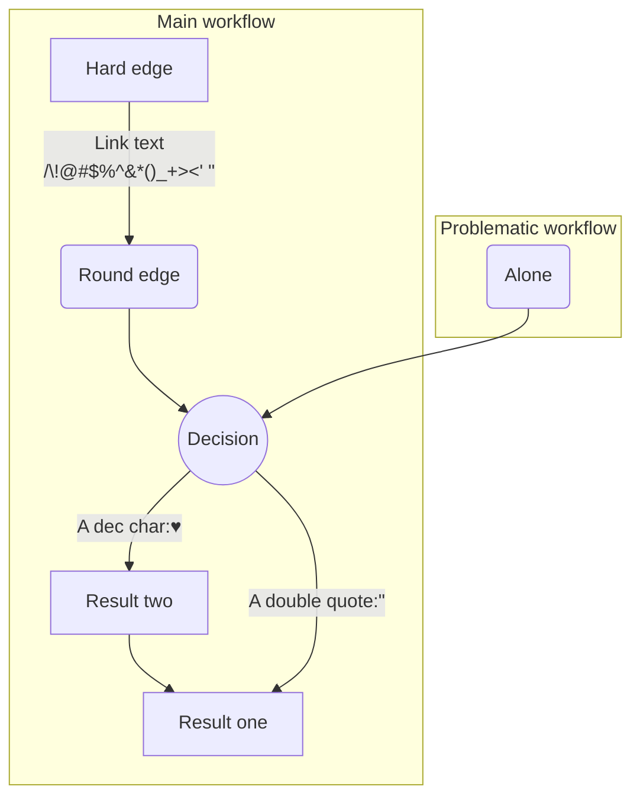
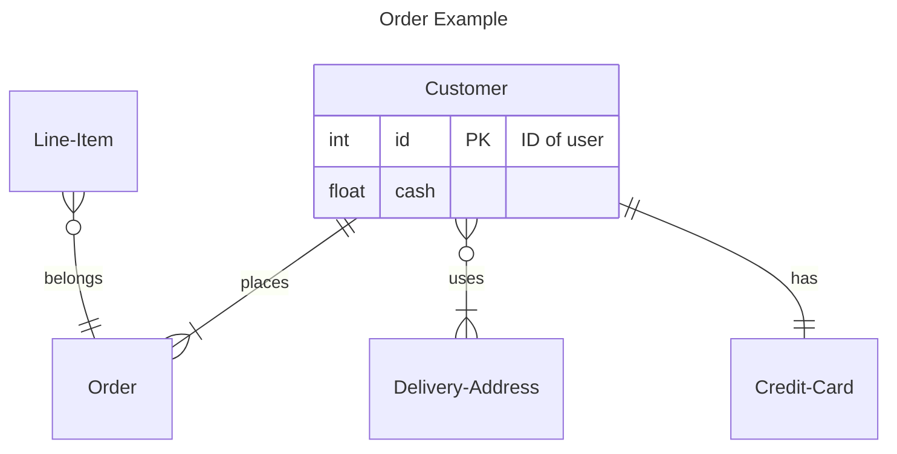
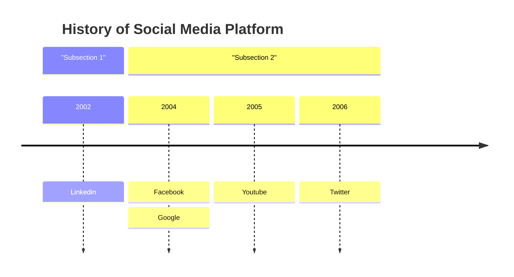
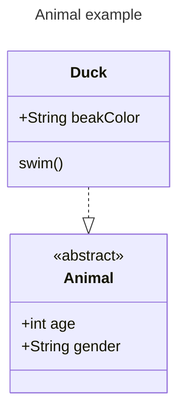

# JBZoo / Mermaid-PHP

[](https://github.com/JBZoo/Mermaid-PHP/actions/workflows/main.yml?query=branch%3Amaster)
[](https://coveralls.io/github/JBZoo/Mermaid-PHP?branch=master)
[](https://shepherd.dev/github/JBZoo/Mermaid-PHP)
[](https://shepherd.dev/github/JBZoo/Mermaid-PHP)
[](https://www.codefactor.io/repository/github/jbzoo/mermaid-php/issues)

[](https://packagist.org/packages/jbzoo/mermaid-php/)
[](https://packagist.org/packages/jbzoo/mermaid-php/stats)
[](https://packagist.org/packages/jbzoo/mermaid-php/dependents?order_by=downloads)
[](https://github.com/JBZoo/Mermaid-PHP/blob/master/LICENSE)

A powerful PHP library for generating [Mermaid](https://mermaid.js.org/) diagrams programmatically. Create flowcharts, ER diagrams, class diagrams, and timelines with a fluent, object-oriented API.

## Table of Contents

- [Installation](#installation)
- [Requirements](#requirements)
- [Features](#features)
- [Quick Start](#quick-start)
- [Diagram Types](#diagram-types)
  - [Flowcharts/Graphs](#flowchartsgraphs)
  - [ER Diagrams](#er-diagrams)
  - [Class Diagrams](#class-diagrams)
  - [Timeline Diagrams](#timeline-diagrams)
- [Output Formats](#output-formats)
- [Development](#development)
- [License](#license)
- [Related Projects](#related-projects)

## Installation

Install via Composer:

```bash
composer require jbzoo/mermaid-php
```

## Requirements

- PHP 8.2 or higher
- ext-json

## Features

✅ **Multiple Diagram Types**: Flowcharts, ER diagrams, class diagrams, and timelines
✅ **Fluent API**: Intuitive method chaining for building complex diagrams
✅ **Multiple Output Formats**: Mermaid syntax, HTML with embedded viewer, live editor URLs
✅ **Theme Support**: Default, forest, dark, and neutral themes
✅ **Rich Customization**: Nodes, links, relationships, styling, and more
✅ **Type Safety**: Full PHP type hints and strict typing
✅ **Zero Dependencies**: Only requires PHP and ext-json

## Quick Start

```php
<?php

use JBZoo\MermaidPHP\Graph;
use JBZoo\MermaidPHP\Node;
use JBZoo\MermaidPHP\Link;

// Create a simple flowchart
$graph = new Graph(['title' => 'My Workflow']);
$graph
    ->addNode($start = new Node('start', 'Start', Node::ROUND))
    ->addNode($process = new Node('process', 'Process Data', Node::SQUARE))
    ->addNode($end = new Node('end', 'End', Node::ROUND))
    ->addLink(new Link($start, $process))
    ->addLink(new Link($process, $end));

// Output Mermaid syntax
echo $graph;

// Generate HTML with embedded viewer
echo $graph->renderHtml(['theme' => 'dark']);

// Get live editor URL for debugging
echo $graph->getLiveEditorUrl();
```

## Diagram Types

### Flowcharts/Graphs

Create complex flowcharts with nodes, links, and subgraphs:

```php
<?php

use JBZoo\MermaidPHP\Graph;
use JBZoo\MermaidPHP\Link;
use JBZoo\MermaidPHP\Node;
use JBZoo\MermaidPHP\Render;

$graph = (new Graph(['abc_order' => true]))
    ->addSubGraph($subGraph1 = new Graph(['title' => 'Main workflow']))
    ->addSubGraph($subGraph2 = new Graph(['title' => 'Problematic workflow']))
    ->addStyle('linkStyle default interpolate basis');

$subGraph1
    ->addNode($nodeE = new Node('E', 'Result two', Node::SQUARE))
    ->addNode($nodeB = new Node('B', 'Round edge', Node::ROUND))
    ->addNode($nodeA = new Node('A', 'Hard edge', Node::SQUARE))
    ->addNode($nodeC = new Node('C', 'Decision', Node::CIRCLE))
    ->addNode($nodeD = new Node('D', 'Result one', Node::SQUARE))
    ->addLink(new Link($nodeE, $nodeD))
    ->addLink(new Link($nodeB, $nodeC))
    ->addLink(new Link($nodeC, $nodeD, 'A double quote:"'))
    ->addLink(new Link($nodeC, $nodeE, 'A dec char:♥'))
    ->addLink(new Link($nodeA, $nodeB, ' Link text<br>/\\!@#$%^&*()_+><\' " '));

$subGraph2
    ->addNode($alone = new Node('alone', 'Alone'))
    ->addLink(new Link($alone, $nodeC));

echo $graph; // Get result as string (or $graph->__toString(), or (string)$graph)
$htmlCode = $graph->renderHtml([
    'debug'       => true,
    'theme'       => Render::THEME_DARK,
    'title'       => 'Example',
    'show-zoom'   => false,
    'mermaid_url' => 'https://cdn.jsdelivr.net/npm/mermaid@10/dist/mermaid.esm.min.mjs',
]); // Get result as HTML code for debugging

echo $graph->getLiveEditorUrl(); // Get link to live editor
```

### Result
[Open live editor](https://mermaid-js.github.io/mermaid-live-editor/#/edit/eyJjb2RlIjoiZ3JhcGggVEI7XG4gICAgc3ViZ3JhcGggXCJNYWluIHdvcmtmbG93XCJcbiAgICAgICAgRVtcIlJlc3VsdCB0d29cIl07XG4gICAgICAgIEIoXCJSb3VuZCBlZGdlXCIpO1xuICAgICAgICBBW1wiSGFyZCBlZGdlXCJdO1xuICAgICAgICBDKChcIkRlY2lzaW9uXCIpKTtcbiAgICAgICAgRFtcIlJlc3VsdCBvbmVcIl07XG4gICAgICAgIEUtLT5EO1xuICAgICAgICBCLS0+QztcbiAgICAgICAgQy0tPnxcIkEgZG91YmxlIHF1b3RlOiNxdW90O1wifEQ7XG4gICAgICAgIEMtLT58XCJBIGRlYyBjaGFyOiNoZWFydHM7XCJ8RTtcbiAgICAgICAgQS0tPnxcIkxpbmsgdGV4dDxicj5cL1xcIUAjJCVeI2FtcDsqKClfKz48JyAjcXVvdDtcInxCO1xuICAgIGVuZFxuICAgIHN1YmdyYXBoIFwiUHJvYmxlbWF0aWMgd29ya2Zsb3dcIlxuICAgICAgICBhbG9uZShcIkFsb25lXCIpO1xuICAgICAgICBhbG9uZS0tPkM7XG4gICAgZW5kXG5saW5rU3R5bGUgZGVmYXVsdCBpbnRlcnBvbGF0ZSBiYXNpczsiLCJtZXJtYWlkIjp7InRoZW1lIjoiZm9yZXN0In19)




### ER Diagrams

Build entity-relationship diagrams for database schemas:

```php
<?php

use JBZoo\MermaidPHP\ERDiagram\Entity\Entity;
use JBZoo\MermaidPHP\ERDiagram\Entity\EntityProperty;
use JBZoo\MermaidPHP\ERDiagram\ERDiagram;
use JBZoo\MermaidPHP\ERDiagram\Relation\ManyToMany;
use JBZoo\MermaidPHP\ERDiagram\Relation\ManyToOne;
use JBZoo\MermaidPHP\ERDiagram\Relation\OneToMany;
use JBZoo\MermaidPHP\ERDiagram\Relation\OneToOne;
use JBZoo\MermaidPHP\ERDiagram\Relation\Relation;
use JBZoo\MermaidPHP\Render;

$diagram = (new ERDiagram(['title' => 'Order Example']));

$diagram
    ->addEntity($customerEntity = new Entity('C', 'Customer', props: [
        new EntityProperty('id', 'int', [EntityProperty::PRIMARY_KEY], 'ID of user'),
        new EntityProperty('cash', 'float'),
    ]))
    ->addEntity($orderEntity = new Entity('O', 'Order'))
    ->addEntity($lineItemEntity = new Entity('LI', 'Line-Item'))
    ->addEntity($deliveryAddressEntity = new Entity('DA', 'Delivery-Address'))
    ->addEntity($creditCardEntity = new Entity('CC', 'Credit-Card'))
    ->addRelation(new OneToMany($customerEntity, $orderEntity, 'places', Relation::ONE_OR_MORE))
    ->addRelation(new ManyToOne($lineItemEntity, $orderEntity, 'belongs', Relation::ZERO_OR_MORE))
    ->addRelation(new ManyToMany($customerEntity, $deliveryAddressEntity, 'uses', Relation::ONE_OR_MORE))
    ->addRelation(new OneToOne($customerEntity, $creditCardEntity, 'has', Relation::ONE_OR_MORE))
;
//header('Content-Type: text/plain');
//echo $diagram; // Get result as string (or $graph->__toString(), or (string)$graph)
$htmlCode = $diagram->renderHtml([
    'debug'       => true,
    'theme'       => Render::THEME_DARK,
    'title'       => 'Example',
    'show-zoom'   => false,
    'mermaid_url' => 'https://cdn.jsdelivr.net/npm/mermaid@10/dist/mermaid.esm.min.mjs',
]); // Get result as HTML code for debugging

echo $diagram->getLiveEditorUrl(); // Get link to live editor
```

### Result
[Open live editor](https://mermaid-js.github.io/mermaid-live-editor/edit#pako:eNp1kE1qxDAMha9itB5fILuSdDG00EK33qixMjH4J9hK6ZDk7qM4U0phqpV4-vSe0AJ9sgQNaK1NZMeeGvWWLWX1_I1h8mRiHVHuHF4yBhOVlIF2LpwCZQNqXbVeF9HqogiNmjz2VH7YVxdJn5mCzLYk8PoH_iSf4qU8cK7w7tyRd1-Ur_rJ2kyl1L25UPnvnD2hzWQd6xazrfyIj_Dl0PZykZWz6v1FiHOn0rBHCPNLDD4hqx7LeGibiXACMQrorLyxmhngkQIZaKQdktzLu8cmJM6cPq6xh4bzTCeYJ4tM99ce4nYDIeuBCQ)




### Timeline Diagrams

Create timeline visualizations for chronological data:

```php
<?php

use JBZoo\MermaidPHP\Timeline\Timeline;
use JBZoo\MermaidPHP\Timeline\Marker;
use JBZoo\MermaidPHP\Timeline\Event;

$timeline = (new Timeline(['title' => 'History of Social Media Platform']))
    ->addSection(
        (new Timeline(['title' => 'Subsection 1']))
            ->addMarker(new Marker('2002', [
                new Event('Linkedin')
            ]))
    )
    ->addSection(
        (new Timeline(['title' => 'Subsection 2']))
            ->addMarker(new Marker('2004', [
                new Event('Facebook'),
                new Event('Google'),
            ]))
            ->addMarker(new Marker('2005', [
                new Event('Youtube'),
            ]))
            ->addMarker(new Marker('2006', [
                new Event('Twitter'),
            ]))
    )
;
//header('Content-Type: text/plain');
//echo $diagram; // Get result as string (or $timeline->__toString(), or (string)$timeline)
$htmlCode = $timeline->renderHtml([
    'debug'       => true,
    'theme'       => Render::THEME_DARK,
    'title'       => 'Example',
    'show-zoom'   => false,
    'mermaid_url' => 'https://cdn.jsdelivr.net/npm/mermaid@10/dist/mermaid.esm.min.mjs',
]); // Get result as HTML code for debugging

echo $diagram->getLiveEditorUrl(); // Get link to live editor
```

### Result
[Open live editor](https://mermaid-js.github.io/mermaid-live-editor/#/edit/eyJjb2RlIjoidGltZWxpbmVcbiAgICB0aXRsZSBIaXN0b3J5IG9mIFNvY2lhbCBNZWRpYSBQbGF0Zm9ybVxuICAgIHNlY3Rpb24gXCJTdWJzZWN0aW9uIDFcIlxuICAgICAgICAyMDAyIDogTGlua2VkaW5cbiAgICBzZWN0aW9uIFwiU3Vic2VjdGlvbiAyXCJcbiAgICAgICAgMjAwNCA6IEZhY2Vib29rIDogR29vZ2xlXG4gICAgICAgIDIwMDUgOiBZb3V0dWJlXG4gICAgICAgIDIwMDYgOiBUd2l0dGVyXG4iLCJtZXJtYWlkIjp7InRoZW1lIjoiZm9yZXN0In19)



### Class Diagrams

Generate UML class diagrams with relationships, namespaces, and cardinality:

```php
<?php

use JBZoo\MermaidPHP\ClassDiagram\ClassDiagram;
use JBZoo\MermaidPHP\ClassDiagram\Concept\Concept;
use JBZoo\MermaidPHP\ClassDiagram\Concept\Attribute;
use JBZoo\MermaidPHP\ClassDiagram\Concept\Visibility;
use JBZoo\MermaidPHP\ClassDiagram\Concept\Method;
use JBZoo\MermaidPHP\ClassDiagram\ConceptNamespace\ConceptNamespace;
use JBZoo\MermaidPHP\ClassDiagram\Relationship\Relationship;
use JBZoo\MermaidPHP\ClassDiagram\Relationship\RelationType;
use JBZoo\MermaidPHP\ClassDiagram\Relationship\Cardinality;
use JBZoo\MermaidPHP\ClassDiagram\Relationship\Link;
use JBZoo\MermaidPHP\Render;

$diagram = (new ClassDiagram())
    ->setTitle('Animal example')
    ->setDirection(\JBZoo\MermaidPHP\Direction::TOP_TO_BOTTOM)
    ->addClass($animalClass = new Concept(
        identifier: 'Animal',
        attributes: [
            new Attribute('age', 'int', Visibility::PUBLIC),
            new Attribute('gender', 'String', Visibility::PUBLIC),
        ],
        annotation: 'abstract'
    ))
    ->addClass($duckClass = new Concept(
        identifier: 'Duck',
        attributes: [
            new Attribute('beakColor', 'String', Visibility::PUBLIC),
        ],
        methods: [
            new Method('swim')
        ],
    ))
    ->addRelationship(new Relationship(
        classA: $duckClass,
        classB: $animalClass,
        relationType: RelationType::REALIZATION
    ))
;
//header('Content-Type: text/plain');
//echo $diagram; // Get result as string (or $diagram->__toString(), or (string) $diagram)
$htmlCode = $diagram->renderHtml([
    'debug'       => true,
    'theme'       => Render::THEME_DARK,
    'title'       => 'Example',
    'show-zoom'   => false,
    'mermaid_url' => 'https://cdn.jsdelivr.net/npm/mermaid@10/dist/mermaid.esm.min.mjs',
]); // Get result as HTML code for debugging

echo $diagram->getLiveEditorUrl(); // Get link to live editor
```

### Result
[Open live editor](https://mermaid-js.github.io/mermaid-live-editor/edit#pako:eNo1kMFugzAMhl8l8mnTEIIS0IoqpG297tSdplzcxGVRSVKFoK1jvPtSCr7E_vz7T-IRpFMENcgO-36vsfVohFXakwzaWfbxKuzcYy9WG-zYKCyLsdvhsQ8eZWiaO3nSNjBsaakOwWvbspasIi_stNrsB3leTVbRkfD85jrn77j_1ubhcZ6Z1Wn61yzXCwsJGPIGtYqvnn0EhC8yJKCO6cl56oOAOB2VOAR3uFoJdfADJTBcFAZavgn1Cbs-0gvaT-fMKool1CP8QJ1znj7zbV5URbkpi21WJXCNOCtTzivO86rMbnQzJfA7O2RpmQApHZx_XxZ7O6Z_kFxzOQ)



## Output Formats

All diagram types support multiple output formats:

### Mermaid Syntax
```php
// Get raw Mermaid syntax
$mermaidCode = (string) $diagram;
echo $diagram; // or use __toString()
```

### HTML with Embedded Viewer
```php
// Generate complete HTML page with Mermaid viewer
$htmlCode = $diagram->renderHtml([
    'theme'       => Render::THEME_DARK,    // dark, forest, default, neutral
    'title'       => 'My Diagram',
    'show-zoom'   => true,
    'debug'       => false,
    'mermaid_url' => 'https://cdn.jsdelivr.net/npm/mermaid@10/dist/mermaid.esm.min.mjs'
]);
```

### Live Editor URL
```php
// Get URL to Mermaid live editor for debugging
$url = $diagram->getLiveEditorUrl();
```

## Development

### Setup
```bash
# Install dependencies
make update

# Run tests
make test

# Run all tests and code quality checks
make test-all

# Run code style checks
make codestyle
```

### Testing
- **Unit Tests**: PHPUnit tests in `tests/` directory
- **Code Coverage**: Available via `make report-all`
- **Static Analysis**: Psalm integration for type safety

## Useful Links

- [Mermaid Documentation](https://mermaid.js.org/) - Official Mermaid.js documentation
- [Mermaid Live Editor](https://mermaid-js.github.io/mermaid-live-editor/) - Online editor for testing diagrams
- [Mermaid on GitHub](https://github.com/mermaid-js/mermaid) - Source code and issues

## License

MIT

## Related Projects

- [CI-Report-Converter](https://github.com/JBZoo/CI-Report-Converter) - Converting different error reports for deep compatibility with popular CI systems.
- [Composer-Diff](https://github.com/JBZoo/Composer-Diff) - See what packages have changed after `composer update`.
- [Composer-Graph](https://github.com/JBZoo/Composer-Graph) - Dependency graph visualization of composer.json based on mermaid-js.
- [Utils](https://github.com/JBZoo/Utils) - Collection of useful PHP functions, mini-classes, and snippets for every day.
- [Image](https://github.com/JBZoo/Image) - Package provides object-oriented way to manipulate with images as simple as possible.
- [Data](https://github.com/JBZoo/Data) - Extended implementation of ArrayObject. Use files as config/array.
- [Retry](https://github.com/JBZoo/Retry) - Tiny PHP library providing retry/backoff functionality with multiple backoff strategies and jitter support.
- [SimpleTypes](https://github.com/JBZoo/SimpleTypes) - Converting any values and measures - money, weight, exchange rates, length, ...
